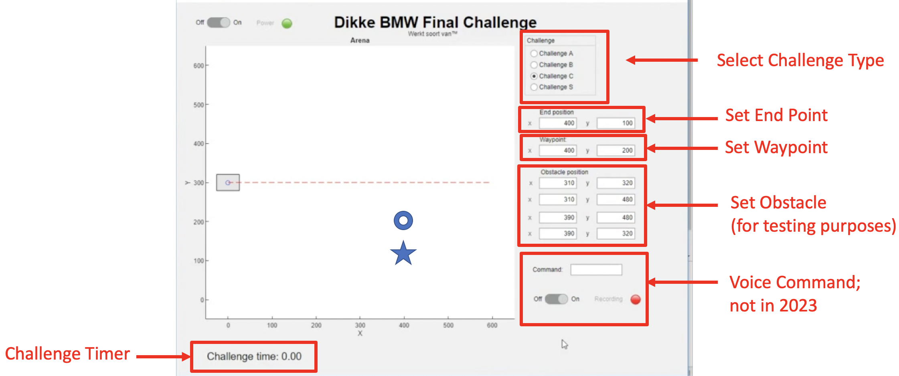
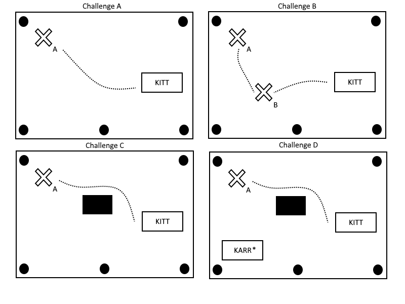

# System Integration and Final Challenge

You have made it to the final part: System Integration.  At this moment you have all the separate subsystems working.  However, this does not mean the project is completed.  The most important part of the project yet to come: making it work all together.
    
During the final challenges, you and your team must navigate KITT from its starting location to an end location by combining what you've learned in the previous modules. You will need to use your locating algorithms in combination with a control system to drive KITT along a path to get it where it needs to go. You will also use the distance sensors on the front of KITT to avoid obstacles. 

At the end of this module, you will have written a script that combines the modules and allows you to complete the challenges (hopefully as the fastest team).

**Learning objectives** The following is learned and practiced in this module:
    - Combining all modules into a well-functioning control system.

**Preparation** 
    - Read this module.
    - Ensure your code from previous Modules is tested and working.

**What is needed**
    - KITT
    - Laptop/PC running Python
    - Access to a field with a microphone setup and audio card.
    - Your locating algorithm from Module 3.
    - Your car model from Module 4.
    - Your control algorithm from Module 5.
    - Your script to make distance measurements with KITT in motion from Module 2.

## System Integration
Before you can start with the integration part, it is necessary to
have completed all the previous subsystems. 
To link these parts together, you must communicate with the complete group about the responsibilities. The assignment during system integration is to complete the big final design such that you can complete the challenges. Read this chapter completely to know what they are.

Focus on the basic challenges first. Once these have been implemented, you can work on the obstacle avoidance and anti-collision system. 

Take it step-by-step, and keep it simple and structured. You'll quickly reach a level where the car shows unexpected behavior and nobody understands why.

For the control system, you can choose to plan a route but you are not required to do so. Important to note is that the location estimates from the locating algorithm must be taken into account during the challenge as the integration of these two is the central focus of the system.  

When integrating the control system with the locating algorithm, it is important keep in mind the time it takes to run your control loop after each locating attempt and consider how you can ensure that you always record a full beacon waveform. Ideally, you drive your car while estimating locations. If necessary, it is permitted to stop the car while measuring. This is much easier to program, but you certainly won't be competing for speed that way.

After you have completed the integration of the control and locating algorithm, you can attempt an implementation of the obstacle detection and avoidance system for challenges C and D. 

If you have time, we recommend to design a GUI; see the figure below for an example. This will facilitate to enter parameters for each challenge, and help you to keep an overview on what's going on. But if you have a tight control loop, you'll have to watch out that updating the graphics is not taking too much time.

Since you have a virtual car model, you could also use a switch and have the virtual car drive the track, so that you can test the control and obstacle detection performance on those moments that the real field is not available.

Do not postpone to document your work. The final report is needed very shortly after the demonstrations.

## Final Challenge

The final challenge for EPO-4 consists of four challenges and a fifth "free challenge". In order to get a passing grade, you have to successfully pass at least the first challenge. With every other challenge you pass you will get a higher grade. You will have maximum two attempts for each challenge. If you fail a challenge, you may not compete in further challenges, except for the "free challenge".

The car reference position is the beacon location.
Before each challenge you are allowed to measure the field and the position of the destination (and waypoints). A challenge starts at a given (known) starting position at the edge of the field. The orientation of KITT is always 90° with respect to the edge of the field. Once the start command has been issued you may not touch KITT nor the PC except for an emergency stop.

KITT may stop everywhere and as many times as needed. There is no time limit except for the fact that everything, including preparation and cleaning up, should happen within $30$ minutes.  Needless to say, you must use the audio beacon for locating KITT, and the ultrasonic sensors for obstacle detection (no "open loop" solutions allowed).

**Challenge A** (60 points)
- KITT drives from the starting position to a specific point A in the field.
        
- Once KITT reaches the destination it must stop and the PC must give a signal.

**Challenge B** (10 points)
- KITT drives from the starting position to point A via another point in the field.
- When KITT reaches the waypoint (B) the examiner must have the time to measure the distance; you should let the car stop for 10 seconds. 
- When KITT reaches the destination (A) it must stop and the PC must give a signal.

**Challenge C** (10 points)
- KITT drives from the starting position to a specific point A in the field.
- When KITT reaches the destination (A) it must stop and the PC must give a signal.
- There is an obstacle on route (two paper bias on top of each other) that has to be avoided.
- When KITT finds the obstacle, its position must be remembered.

**Challenge D** (8 points)
- KITT drives from the starting position to a specific point A in the field.
- When KITT reaches the destination it must stop and the PC must give the signal.
- There is another car involved (stationary but with working beacon), this car has to be avoided. 
- There is an obstacle on route (two paper bins on top of each other) that has to be avoided.

**Free Challenge** (7 points)
- Invent your own challenge and impress us! For example, drive form A to B to C where after B you will need to drive backwards to make the turn.
- Points awarded depending on the difficulty and creativity of the task.

**Grading**

- If you complete each task perfectly you receive the total amount of points. Penalty points are deducted for missing the target or hitting the obstacle. 

ℹ️ The grading for a task cannot be negative. 

- The measurements are done with respect to the center of the louspeaker on top of KITT. 

- In *Challenge A* you may miss the destination by $30$ cm but for every additional $10$ cm you will lose $5$ points. You can't lose more than $15$ points.

- In *Challenges B-D* you may miss the targets by $30$ cm and for every additional $10$ cm you will lose $2.5$ points, this holds for both the way point and the destination.

- For each time KITT hits an obstacle or another car you will lose $2.5$ points.

**Bonus:** The time you take to complete the challenges will be measured. The fastest team will receive 10 bonus points and the second fastest will receive 5 bonus points. 

ℹ️ It is not possible to receive more than 100 points for the whoel competition.

The figure below is a example depiction of the Challenges (*On the old television series, KARR is the archenemy of KITT*)

## Final report

 Instructions for the final report are similar to those of the midterm report (see Mid-term report chapter). Aim for a **well-structured**, compact yet complete report of about 30 pages (plus Python code in an appendix). Do not forget to systematically report on testing/verification: how do you test (each subsystem, and the entire system), what are the results from the test, what do you conclude. Include the results of the final challenge in the report as well. Note that the final challenge is not a test, rather it is a demonstration. With extensive testing, these results won't be a surprise to the reader!
    
The report is judged by committee members that are not indepth familiar with EPO-4, or the manual. Your report has to be sufficiently self-contained.
    
The submission deadline is listed on Brightspace, typically it is one day after the final challenge.  Submit your report using the corresponding submission folder.

## Final presentation and discussion

 In week 10 (consult Brightspace for the exact date), you present and defend your final report in front of an examination committee. The examinators will ask questions about your design choices and aspects of teamwork.  This will be part of your grade.

The presentation lasts at most 5 min. This is too short to have all team members presenting.  Focus on the highlights and special features of the design, and mention the work breakdown and distribution of tasks to team members.

The examination will last about 30 min.  After the examination you will be asked to fill in a peer review form.  Individual grades are differentiated depending on staff observations and the outcome of the peer review.

 
