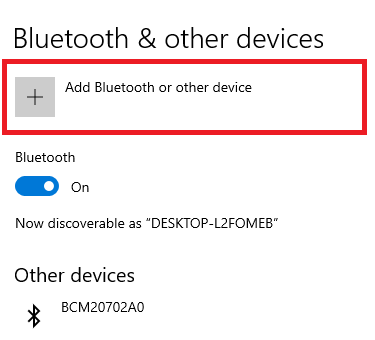
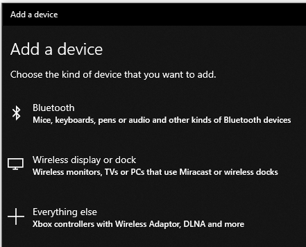
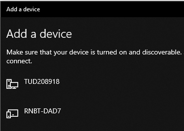
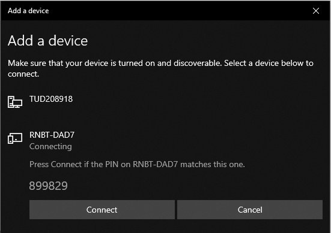
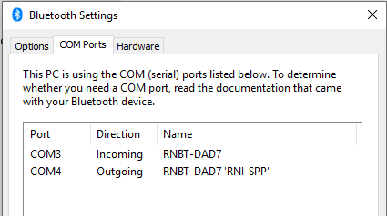

# Serial Communication with Windows

This Appendix describes how the serial connection to the car from Windows (using Bluetooth) is implemented.

## Connecting KITT to a PC on Windows 10

In the figure below, the steps can be seen how KITT can be connected to a PC with Windows 10 installed. 

- Note that all KITTs have their Bluetooth hardware address written in the front of the car. Use this identifier to choose the right Bluetooth device to pair: Step 3 and 4.

- Step 6, the correct port to take note of is the one listed as *Outgoing*. This is the port you have to use in your setup.

### Steps how to connect KITT to the PC

  
  

